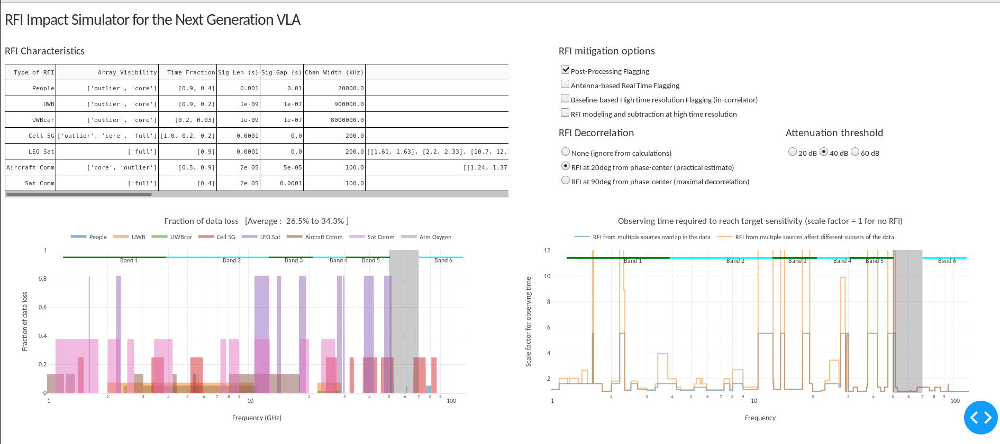

# ngVLA RFI Impact Simulator

Estimate the fraction of data loss due to RFI for the ngVLA using sample RFI characteristics, several RFI mitigation options and the effect of decorrelation. 
The purpose is to do a cost-benefit analysis of implementing end-to-end RFI mitigation solutions. 

The app allows editing of RFI characteristics (types of RFI, space/time/frequency occupancy, channel width and duty cycle 
of each emission type, etc), choices of one or more RFI mitigation solutions and calculations of attenuation 
due to RFI decorrelation. 
A data loss fraction is estimated based on the RFI filling factor (across baselines, time and frequency) when it is viewed
at the channel widths and integration timesteps appropriate to each RFI mitigation solution option. This calculation includes 
calculations of fractions of baselines over which RFI is correlated, decorrelated or uncorrelated.   
For each processing stage, data rates at which the algorithms must operate are also calculated.

For a given set of RFI characteristics, one can estimate the fractional data loss across frequency, assuming only 
post-processing RFI identification and flagging.
Then, by choosing one or more RFI mitigation options and comparing data loss fractions, one can estimate the fraction
of data that is recoverable by efficient RFI mitigation.  
All data loss estimates are also translated to a saving in extra observing time that would otherwise have been 
required to compensate for RFI data losses. 
Finally, in order to perform a cost-benefit analysis, these gains may be compared to the compute cost of 
implementing the chosen RFI solutions, framed as a data-rate at which algorithms must be applied in order 
to achieve the estimated degree of data recovery.


Additional documentation is being preparad. Below is a screenshot of the app. 




#To run the simulator : 

##Install python3

```
export PPY=`which python3`
virtualenv -p $PPY --setuptools ./local_python3
./local_python3/bin/pip install --upgrade pip
./local_python3/bin/pip install --upgrade numpy matplotlib ipython dash pandas
```

##Run the app 
```
./local_python3/bin/python rfiapp.py
```

Point your browser to   http://127.0.0.1:8050/


