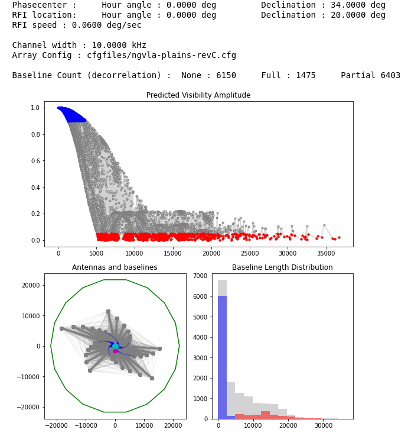

# RFI Attenuation due to decorrelation and fringe-winding

What : A tool to predict the amount of expected attenuation of an RFI signal in an interferometer.

How : Implements Eqn 19 from Thompson et al, 1982 for user-definable phasecenter and RFI locations and a variety of interferometer array configurations. 

